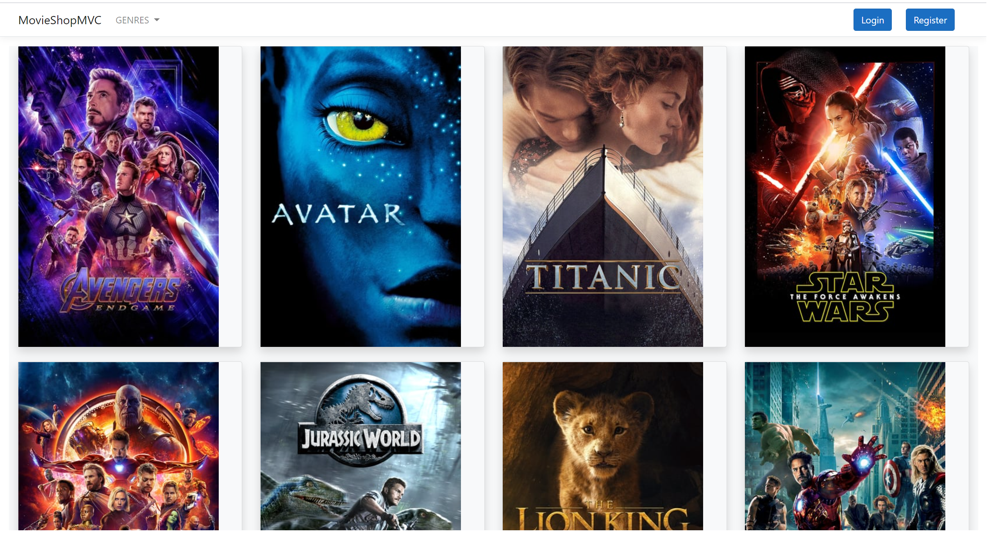
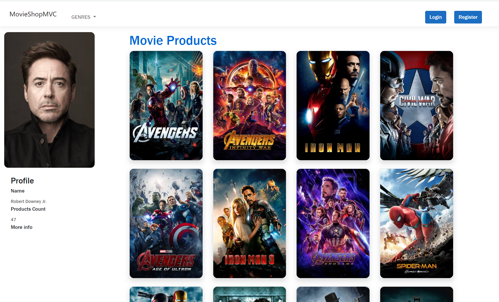
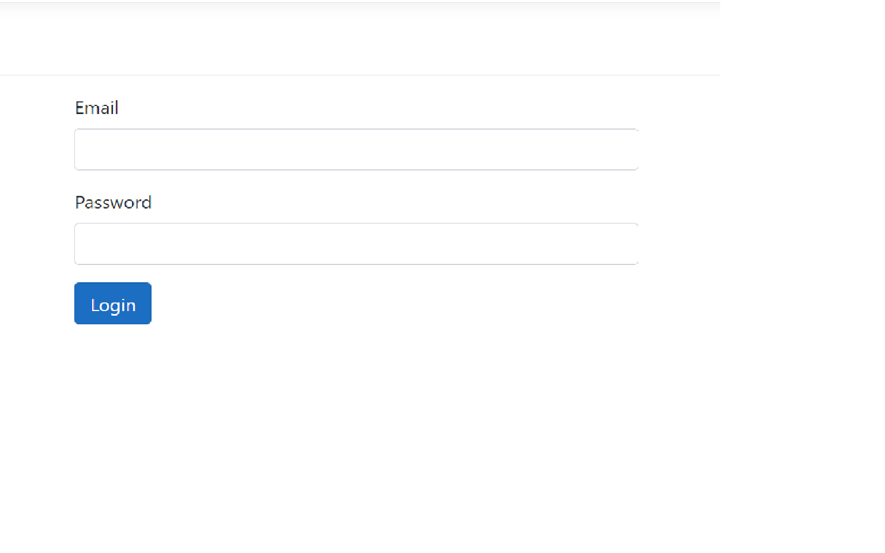
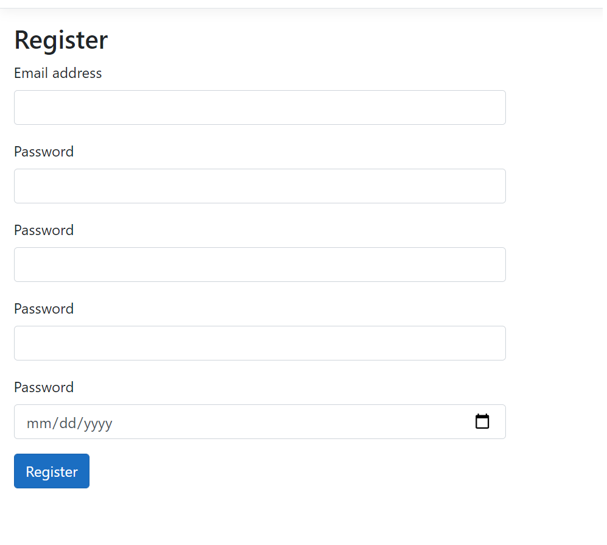
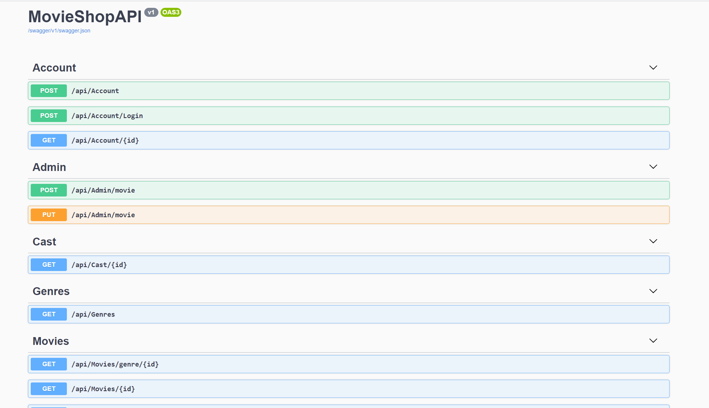

# Movie Shop Application
This is a movie shop application. It's a online movie shop, created for user to purchase movie on the website. I develop it with ASP .Net Core, and I connect it with the server by using Entity Framework Core, and also create and update database with EF Core Code First approach using migrations.The clients could add, delete and update the data in the database from the clientside. The business logic was implemented to extract the correct data and presented in the client side. Also this website contains the webpages, decorated by the BOOTSTRAP, such as login page and register page. 
<li>I also add the hashing and salt to the user password when the user registers the account and create a cookie authentication to 
check if the user login time expired to enhance the security level. </li>
<li>There is a homepage that displays the top revenue movies and all the movie posters are clickable. The page will direct to the certain movie details when clicking the movie poster. </li>
<li>In the movie details page, we could click the cast name and the page will direct to the cast details.</li>
<li>In addition, API was built, so we could use other frontend frameworks (Vue, React, Angular) to fetch the Json data and render the HTML page.</li>

## Homepage 

## Movie detail page 

## Cast detail page 

## Login/Register

## API diagram 

